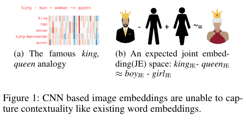
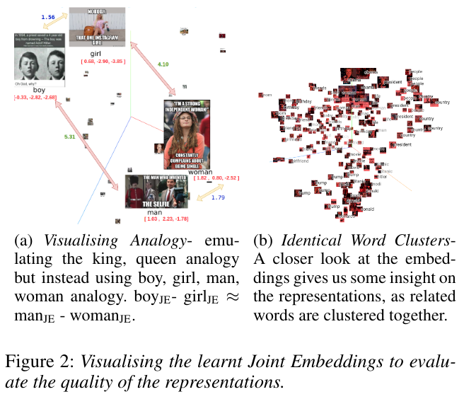

# Memotion Analysis Through The Lens Of Joint Embedding
This repository contains the experiments conducted as described in the paper ['Memotion Analysis through the Lens Of Joint Embedding'](#). This paper has been accepted for a poster presentation in the AAAI Student Abstract and Poster Program (SA-22).


### Motivation

<p align="center">
  
</p>

### Visualisation

<p align="center">
  
</p>

### File Description

* base_models: contains code used for training the reference models.

* taskA: contains experiments related to Task A (sentiment analysis).

* taskB: contains experiments related to Task B (emotion classification).

* taskC: contains experiments related to Task C (semantic sub-classification of emotion).
 


For details about individual files, refer to the respective folders.

## Reference
If you find this repo useful, please cite our paper:
```
    @inproceedings{gunti-etal-memotion,
    title = {Memotion Analysis through the Lens of Joint Embedding},
    author = {Nethra Gunti and  Sathyanarayanan Ramamoorthy and Parth Patwa and Amitava Das}
    booktitle =  {Proceedings of the AAAI Conference on Artificial Intelligence},
    year = {2022},
   }

```
